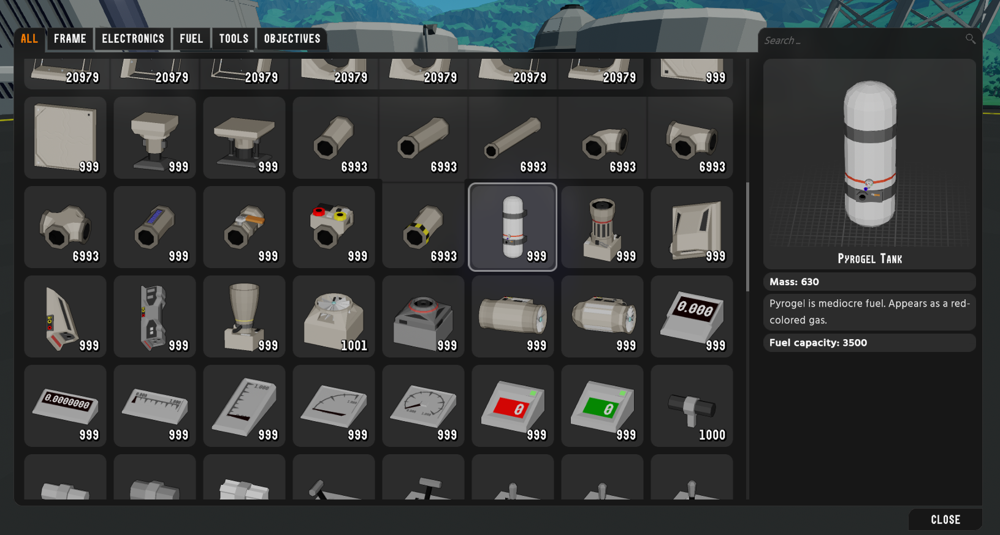
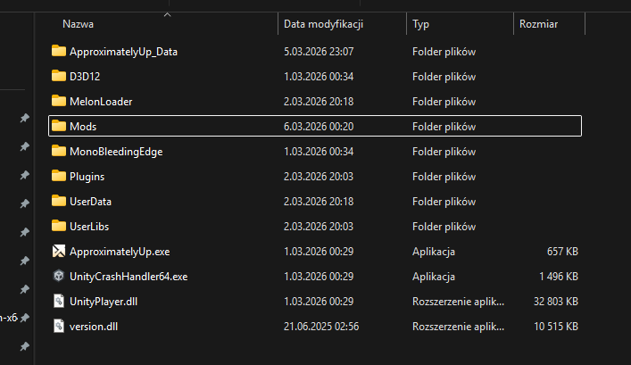
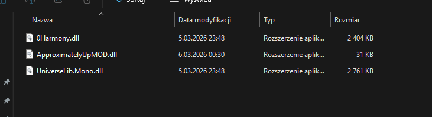

# Approximately Up MOD

- status as of March 6: WORKING
- game [version](https://steamdb.info/app/4396220/history/?changeid=34252973)

## What this mod does

This mod adds items that are available in the game files but are locked.

## Screenshots (In Game)

These screenshots show what the mod adds in the game:





## Requirements

- MelonLoader is required.
- Install (or update) MelonLoader using this [official guide](https://github.com/LavaGang/MelonLoader.Installer/blob/master/README.md#how-to-install-re-install-or-update-melonloader).

## Installation

1. Download Mod files -> [releases](https://github.com/DAMIOTF/Approximately-Up-MOD/releases/tag/Release)
2. Install MelonLoader first (link above).
3. Open your game folder.
4. Go to the `Mods` folder (create it if it does not exist).
5. Copy the mod `.dll` files into the `Mods` folder.
6. Start the game.
7. To run the mod, click F10

## File Structure Check

These images show how your game files should look after installation:




## Notes

- If the mod does not load, make sure MelonLoader is installed correctly.
- Check game and MelonLoader versions if you have issues.

- If you have any problems, please contact me on discord: dmtftf.

## Source Code Compilation Guide

## What is required

- Windows
- .NET Framework 4.7.2 targeting pack
- Visual Studio or Build Tools with MSBuild
- NuGet restore support
- Local game files from Approximately Up Demo

## Required dependencies

From NuGet/Internet:

- `0Harmony.dll` [download](https://www.nuget.org/packages/Lib.Harmony)
- `UniverseLib.Mono.dll` [download](https://github.com/sinai-dev/UniverseLib/releases)

From game folder (`ApproximatelyUp_Data/Managed`):

- `Assembly-CSharp.dll`
- `UnityEngine.dll`
- `UnityEngine.CoreModule.dll`
- `UnityEngine.InputLegacyModule.dll`
- `UnityEngine.IMGUIModule.dll`
- `UnityEngine.TextRenderingModule.dll`
- `UnityEngine.UI.dll`
- `UnityEngine.UIModule.dll`
- `Unity.Collections.dll`
- `Unity.Entities.dll`
- `Unity.Mathematics.dll`

From MelonLoader folder:

- `MelonLoader.dll`

## Build steps

1. Restore NuGet packages.
2. Build `ApproximatelyUpMOD.csproj` in `Release`.
3. Use output from `bin/Release`.

Example build command:

```powershell
dotnet msbuild .\ApproximatelyUpMOD.csproj /t:Build /p:Configuration=Release /p:GameRootDir="D:\SteamLibrary\steamapps\common\Approximately Up Demo" /p:UniverseLibPath="D:\SteamLibrary\steamapps\common\Approximately Up Demo\Mods\UniverseLib.Mono.dll"
```

Compiled files are generated in `bin/Release`.

